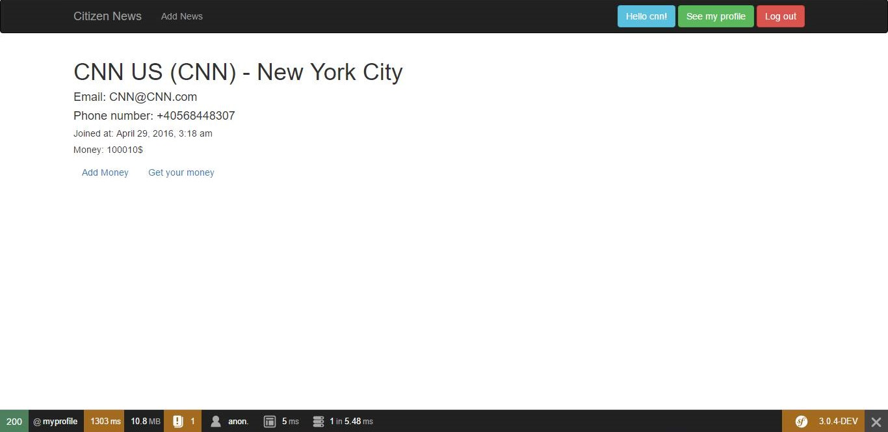

CitizenNews
===========

 A web application developed using Symfony during a one month PHP training in May 2016. 

 The principle behind it is citizen journalism: people take photos or videos at an event's scene and then sell them to media companies. 

